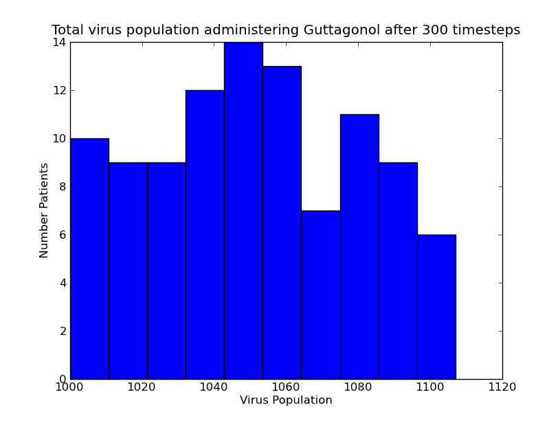

# MIT-6.00-Coursework

Coursework from Introduction to Computer Science and Programming MIT 6.0

Self-guided in summer of 2012

https://ocw.mit.edu/courses/electrical-engineering-and-computer-science/6-00-introduction-to-computer-science-and-programming-fall-2008/index.htm

 